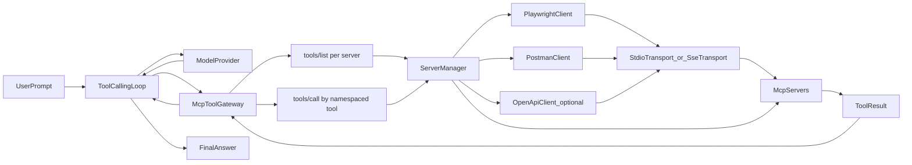

# Tool Gateway Architecture

## High-Level Flow

## Component Responsibilities

- `ToolCallingLoop`
  - Sends messages to model provider.
  - Decides whether to continue with tool calls or return final answer.

- `McpToolGateway`
  - Discovers tools from all configured MCP servers (`tools/list`).
  - Builds namespaced tool index (for example `playwright.browser_navigate`).
  - Routes each `tools/call` request to the right server.

- `ServerManager`
  - Starts/stops MCP server processes.
  - Creates and caches transport clients per server.

- `Stdio/SSE Transports`
  - Handles JSON-RPC request/response flow to MCP servers.
  - Applies timeout and error propagation.

- `MCP Servers`
  - Execute real tool actions (browser automation, API collection runs, optional OpenAPI wrappers).

## Runtime Sequence

1. Agent loop asks gateway for available tools.
2. Gateway calls `tools/list` on each server and caches tool metadata.
3. Model returns a tool call.
4. Gateway resolves the namespaced tool and issues `tools/call`.
5. Tool result is injected back into loop context.
6. Loop repeats until model produces final response.
